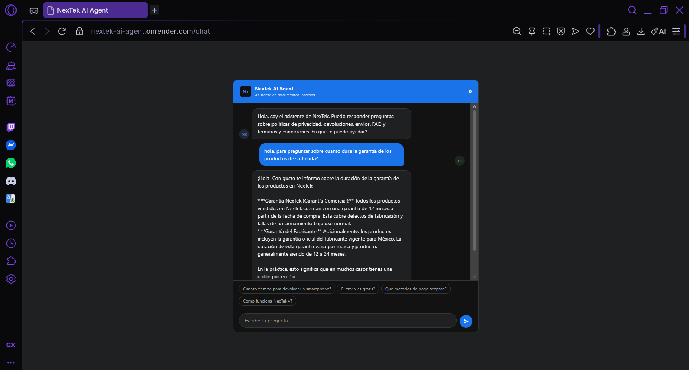

# NexTek AI Agent

Agente conversacional de inteligencia artificial que permite consultar documentos internos de una empresa usando lenguaje natural, sin necesidad de abrir ningún archivo.

Desarrollado como proyecto final del challenge de implementación de IA — simulando el caso real de un e-commerce que necesita que sus colaboradores puedan hacer preguntas sobre políticas y procedimientos internos sin perder tiempo buscando en documentos.

---

## El problema que resuelve

Las empresas acumulan decenas de documentos internos: políticas, manuales, guías, términos y condiciones. Cuando alguien necesita una respuesta específica, termina abriendo archivos, buscando con Ctrl+F y a veces ni así encuentra lo que busca.

Este agente resuelve eso: le haces una pregunta en español y te responde directamente, citando de qué documento y página viene la información.

---

## Arquitectura

El proyecto usa el patrón **RAG (Retrieval-Augmented Generation)**, que combina búsqueda semántica con generación de texto:

```
PDFs
 │
 ▼
PyPDF — extrae el texto de cada página
 │
 ▼
LangChain Text Splitter — divide el texto en fragmentos de 1500 caracteres
 │
 ▼
Gemini Embeddings — convierte cada fragmento en un vector numérico
 │
 ▼
FAISS — guarda los vectores en un índice para búsqueda rápida
 │
 ▼
(cuando llega una pregunta)
 │
 ▼
Retriever — busca los 5 fragmentos más relevantes para la pregunta
 │
 ▼
Gemini 2.5 Flash — lee los fragmentos y genera la respuesta en español
 │
 ▼
FastAPI — expone todo como API REST
 │
 ▼
chat.html — interfaz de chat visual para el usuario
```

### Por qué estas tecnologías

- **LangChain** — orquesta todo el flujo RAG con pocas líneas de código
- **Google Gemini** — accesible con plan gratuito, modelos actualizados y buenos resultados en español
- **FAISS** — librería de Facebook para búsqueda vectorial, rápida y que funciona sin servidor externo
- **FastAPI** — framework moderno para APIs en Python, con documentación automática incluida
- **Render** — plataforma de deploy gratuita que se conecta directamente con GitHub

---

## Documentos incluidos

La base de conocimiento del agente está formada por 5 documentos de **NexTek**, una tienda de electrónica ficticia creada para este proyecto:

| Documento | Contenido |
|---|---|
| Política de Privacidad | Datos personales, derechos ARCO, cookies, seguridad |
| Política de Reembolso y Devoluciones | Plazos por categoría, proceso de devolución, garantías |
| Preguntas Frecuentes (FAQ) | Compras, pagos, envíos, programa de puntos |
| Guía de Envíos y Entregas | Tarifas, tiempos, paqueterías, rastreo |
| Términos y Condiciones | Marco legal, derechos del consumidor, jurisdicción |

---

## Ejemplos de preguntas y respuestas

**Pregunta:** ¿Cuánto tiempo tengo para devolver un smartphone?

**Respuesta:** Tienes 30 días naturales para devolver un smartphone, contados desde la fecha en que recibiste el producto. El producto debe estar en su empaque original y sin daño físico.

*Fuente: Política de Reembolso y Devoluciones - pág. 2*

---

**Pregunta:** ¿El envío es gratis en NexTek?

**Respuesta:** Sí, el envío estándar es gratuito en compras iguales o mayores a $999 MXN. Para compras menores, el costo es de $99 MXN. Los clientes con membresía Gold y Platinum siempre tienen envío gratuito sin mínimo de compra.

*Fuente: Guía de Envíos y Entregas - pág. 3*

---

**Pregunta:** ¿Qué métodos de pago aceptan?

**Respuesta:** NexTek acepta los siguientes métodos de pago: tarjetas Visa, Mastercard y American Express, PayPal, OXXO Pay, transferencia SPEI y saldo NexTek+. También ofrecen meses sin intereses con tarjetas participantes.

*Fuente: FAQ - pág. 2*

---

**Pregunta:** ¿Cómo puedo ejercer mis derechos ARCO?

**Respuesta:** Puedes ejercer tus derechos de Acceso, Rectificación, Cancelación u Oposición enviando una solicitud a privacidad@nextek.com.mx con tu nombre completo, correo registrado y una copia de tu identificación oficial. NexTek responde en un plazo máximo de 20 días hábiles.

*Fuente: Política de Privacidad - pág. 4*

---

## Stack tecnológico

| Componente | Tecnología | Versión |
|---|---|---|
| Lenguaje | Python | 3.11 |
| Framework web | FastAPI | 0.139.0 |
| Orquestación IA | LangChain | 1.3.13 |
| Modelo de chat | Google Gemini 2.5 Flash | — |
| Embeddings | Google Gemini Embedding 001 | — |
| Base vectorial | FAISS | 1.14.3 |
| Lectura de PDFs | PyPDF | 6.14.2 |
| Deploy | Render | — |

---

## Instalación y ejecución

### Requisitos previos

- Python 3.11
- API Key de Google Gemini
- Git

### Pasos

**1. Clona el repositorio**
```bash
git clone https://github.com/ricardo2175539412a-cpu/nextek-ai-agent.git
cd nextek-ai-agent
```

**2. Crea y activa el entorno virtual**

En Windows:
```bash
py -3.11 -m venv venv
venv\Scripts\activate
```

En Mac / Linux:
```bash
python3.11 -m venv venv
source venv/bin/activate
```

**3. Instala las dependencias**
```bash
pip install -r requirements.txt
```

**4. Configura las variables de entorno**

Copia el archivo de ejemplo y completa tu API Key de Gemini:

```
GOOGLE_API_KEY=          ← aquí va tu API Key de Google Gemini
DOCS_DIR=./Docs
INDEX_DIR=./nextek_index
```

Puedes obtener una API Key gratuita en Google AI Studio.

**5. Coloca los documentos PDF**

Crea una carpeta `Docs/` en la raíz del proyecto y coloca ahí los 5 archivos PDF de NexTek.

**6. Inicia el servidor**
```bash
python -m uvicorn app:app --reload
```

**7. Abre la interfaz de chat**

Ve a: `http://127.0.0.1:8000/chat`

### Nota sobre el índice FAISS

La primera vez que ejecutes el servidor construirá automáticamente el índice FAISS procesando los PDFs. Este proceso tarda 2-3 minutos dependiendo del límite de la API. Las siguientes veces cargará el índice desde disco en segundos.

---

## Deploy en Render

La aplicación está desplegada y accesible en:

**https://nextek-ai-agent.onrender.com/chat**

### Captura de la aplicación en producción



### Cómo se hizo el deploy

1. Se conectó el repositorio de GitHub a Render
2. Se configuraron las variables de entorno `GOOGLE_API_KEY`, `DOCS_DIR` e `INDEX_DIR` en el panel de Render
3. Render detectó el `Dockerfile` y construyó la imagen automáticamente
4. El agente quedó accesible públicamente en `/chat` con la interfaz visual completa

---

## Estructura del proyecto

```
nextek-ai-agent/
├── app.py                 # API principal con FastAPI
├── chat.html              # Interfaz de chat visual
├── requirements.txt       # Dependencias del proyecto
├── Dockerfile             # Configuración para el deploy
├── .env.example           # Plantilla de variables de entorno
├── .gitignore             # Archivos excluidos del repositorio
├── README.md              # Este archivo
├── nextek_agente.ipynb    # Notebook de prototipado en Google Colab
├── assets/
│   └── demo.png           # Captura del deploy en producción
└── Docs/                  # Documentos PDF (no incluidos en el repo)
    ├── 01_NexTek_Politica_Privacidad.pdf
    ├── 02_NexTek_Politica_Reembolso_Devoluciones.pdf
    ├── 03_NexTek_FAQ.pdf
    ├── 04_NexTek_Guia_Envios_Entregas.pdf
    └── 05_NexTek_Terminos_Condiciones.pdf
```

---

## Decisiones técnicas y aprendizajes

Durante el desarrollo surgieron varios desafíos interesantes:

**Rate limits de la API gratuita de Gemini** — Al generar embeddings para los 71 fragmentos de texto, la API devuelve error 429 si se hacen demasiadas llamadas seguidas. La solución fue procesar los fragmentos en lotes de 50 con una pausa de 15 segundos entre cada lote.

**Compatibilidad de versiones de LangChain** — Entre las versiones recientes de LangChain varios módulos se movieron a paquetes separados como `langchain-text-splitters` y `langchain-core`. Fue necesario actualizar los imports y las dependencias durante el desarrollo.

**Modelos de embedding deprecados** — El modelo `embedding-001` fue reemplazado por `gemini-embedding-001`. Se aprendió a consultar la lista de modelos disponibles de forma dinámica antes de elegir uno.

**Índice FAISS en el deploy** — Al hacer deploy en Render, el servidor no podía construir el índice desde cero por los límites de la API en entornos de producción. La solución fue incluir el índice precompilado directamente en el repositorio.

---

*Challenge de Implementación de Inteligencia Artificial*
*Stack: Python · LangChain · Google Gemini · FAISS · FastAPI · Render*
